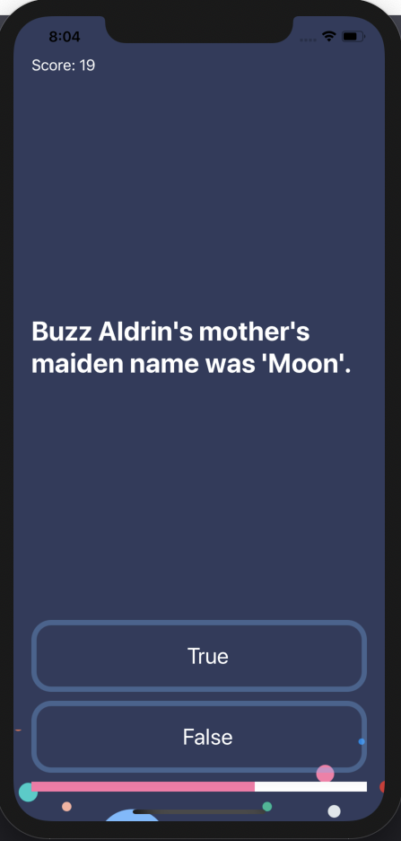
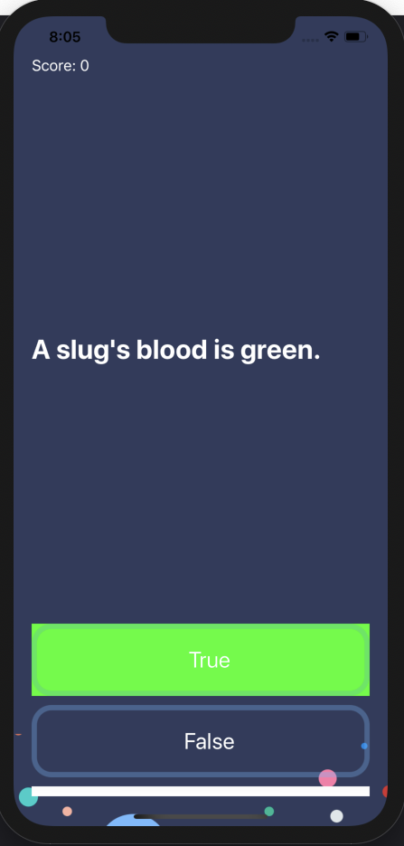

# 308_Quizzler

## Aufgabe:
Erstelle die Quiz-App "Quizzler"
 

## View
Gestalte die GUI entsprechend den Screenshots!

## Model
- Erzeuge eine struct "Question"  
  - die Struct beinhaltet eine Question und eine Answer (beides String)
- Erstelle eine struct "QuizBrain"
- beinhaltet alle Quiz-Fragen (Array von Question), sowie die QuizLogik
  - Methoden:
    - um aktuelle Frage zu erhalten
    - zur Fortschrittsberechnung
    - Punktestand retournieren
    - Methode für nächste Frage
    - Methode, um Antwort zu überprüfen
- Fragen:
```
       Question(q: "A slug's blood is green.", a: "True"),
       Question(q: "Approximately one quarter of human bones are in the feet.", a: "True"),
       Question(q: "The total surface area of two human lungs is approximately 70 square metres.", a: "True"),
       Question(q: "In West Virginia, USA, if you accidentally hit an animal with your car, you are free to take it home to eat.", a: "True"),
       Question(q: "In London, UK, if you happen to die in the House of Parliament, you are technically entitled to a state funeral, because the building is considered too sacred a place.", a: "False"),
       Question(q: "It is illegal to pee in the Ocean in Portugal.", a: "True"),
       Question(q: "You can lead a cow down stairs but not up stairs.", a: "False"),
       Question(q: "Google was originally called 'Backrub'.", a: "True"),
       Question(q: "Buzz Aldrin's mother's maiden name was 'Moon'.", a: "True"),
       Question(q: "The loudest sound produced by any animal is 188 decibels. That animal is the African Elephant.", a: "False"),
       Question(q: "No piece of square dry paper can be folded in half more than 7 times.", a: "False"),
       Question(q: "Chocolate affects a dog's heart and nervous system; a few ounces are enough to kill a small dog.", a: "True")
```

## Controller
- zeigt aktuelle Frage an, die Punkte, sowie 2 Buttons für Wahr/Falsch
- wenn der User eine Frage beantwortet, so soll der von ihm gedrückte Button für eine bestimmte Zeit grün oder rot leuchten
- nach Ablauf der Zeit, wird die Buttonfarbe zurückgesetzt und die nächste Frage angezeigt
